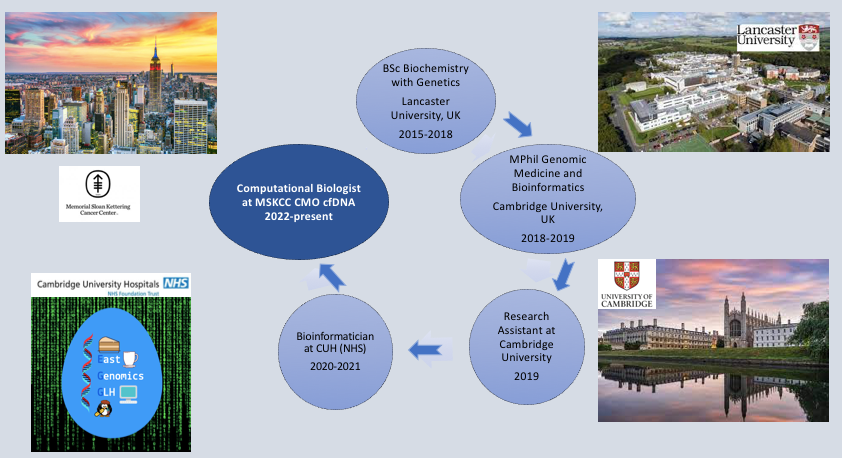

An overview of my academic and work experiences

## About me 
My name is Carmelina and I am half Cypriot and half Italian. I will be reporting as a Computational Biologist at the CMO cfDNA Informatics group at MSKCC. I have a Bachelors degree in Biochemistry and Genetics from Lancaster University and an MPhil in Genomic Medicine and Bioinfomatics from the University of Cambridge. I have spent the last six years in the United Kingdom for both my studies and work and have always wanted to explore the United States, so here I am.

My previous work experience was at Cambridge University Hospitals (NHS Foundation) as a Bioinformatician. I have led and developed the somatic bioinformatics workflow called Uranus (Ουρανός: God of the Sky) to support the validation of a new myeloid target NGS panel for the Department of Hemato-Oncology. This workflow uses mutect2 and pindel as variant callers and variants are annotated by VEP and ClinVar. Another project I led was the development and validation of the sample contamination workflow called Aphrodite (Αφροδίτη: Godess of Beauty). The Aphrodite pipeline is used to generate genotype calls using the NimaGen EasySeqTM Kit which contains 34 highly curated SNPs. Ultimately, to confirm sequencing results to ensure that a genomic sequence originates from the correct person on the referral. Finally, I have validated new technology sequencers to aid the smooth transition from Hiseqs to Novaseqs for the clinical service. 

As part of my master degree I had the opportunity to work on the UK 100,000 Genomes Project for my research project. The title of the project; “Harnessing the power of the UK 100-thousand genome project to investigate the role of Fanconi Anemia genes in heritable cancer predisposition”. This was an association analysis exploring rare germline variants in Fanconi Anemia genes in a range of cancers and cancer predisposition syndromes. The project was presented as a poster at the Genomics England Research Conference in November 2019 which received the 1st prize in the poster competition.

During my personal time and weekends I enjoy working out in the gym, exploring new places and eating. 
